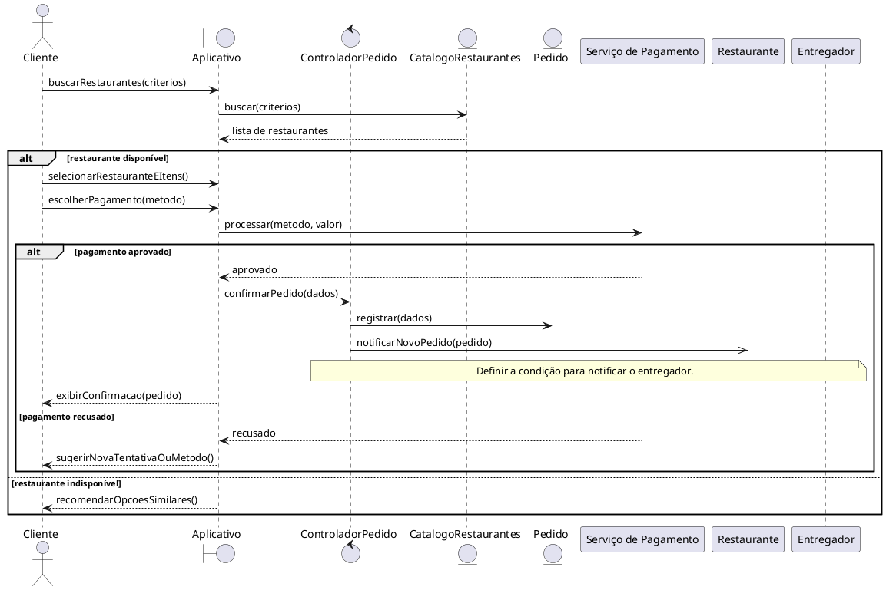

# 09 - Diagrama de Sequência

## Objetivo

Este roteiro orienta a elaboração de um Diagrama de Sequência para um caso de uso, mostrando a ordem das mensagens trocadas entre atores, telas, controles e entidades. O diagrama deve ser rastreável aos requisitos, ao caso de uso e ao protótipo de baixa fidelidade.

## Instruções de preenchimento

1. Escolha um caso de uso prioritário e registre seu identificador e seus atores.
2. Consulte o levantamento de requisitos e relacione os requisitos funcionais e as regras de negócio aplicáveis. Quando uma informação não estiver especificada, registre-a como ponto a validar em vez de assumir uma regra.
3. Identifique os participantes que colaboram no cenário: ator, interface (boundary), controle (control), dados ou serviços (entity) e sistemas externos, se houver.
4. Descreva as mensagens na ordem em que acontecem. Diferencie chamadas síncronas, notificações assíncronas e retornos.
5. Represente o fluxo principal e os fluxos alternativos/excepcionais em fragmentos como `alt` no PlantUML.
6. Confira se o diagrama é compatível com o caso de uso e com as telas do protótipo.

## Template — Diagrama de Sequência por Caso de Uso

### 1. Identificação

- **Sistema:**
- **Caso de Uso:**
- **ID do Caso de Uso:**
- **Ator(es):**
- **Prioridade:**
- **Responsável:**
- **Data:**

### 2. Referências

- **Requisitos relacionados (ID):**
- **Documento de requisitos:**
- **Diagrama de Caso de Uso (link/imagem):**
- **Protótipo de Baixa Fidelidade (tela/fluxo):**
- **Regra(s) de negócio associada(s):**
- **Lacunas ou decisões pendentes:**

### 3. Cenário Modelado

- **Objetivo do cenário:**
- **Pré-condições:**
- **Pós-condições:**
- **Gatilho de início:**

### 4. Participantes (Lifelines)

- **Ator:**
- **Boundary (Interface/Tela):**
- **Control (Orquestração):**
- **Entity (Dados/Serviços):**
- **Sistemas externos (se houver):**

### 5. Fluxo Principal (mensagens)

| Passo | Remetente | Destinatário | Mensagem/Ação | Tipo (sync/async/retorno) |
|------:|-----------|--------------|---------------|----------------------------|
| 1 |  |  |  |  |
| 2 |  |  |  |  |
| 3 |  |  |  |  |

### 6. Fluxos Alternativos e Exceções

| ID | Condição | Descrição do fluxo | Impacto |
|----|----------|--------------------|---------|
| A1 |  |  |  |
| E1 |  |  |  |

### 7. Regras de Negócio Aplicadas

- **RN-xx:**
- **RN-yy:**

### 8. Pontos de Validação

- [ ] Fluxo compatível com o caso de uso.
- [ ] Mensagens consistentes com os requisitos funcionais.
- [ ] Alternativas e exceções representadas.
- [ ] Participantes aderentes à arquitetura proposta.
- [ ] Correspondência com o protótipo de baixa fidelidade.
- [ ] Lacunas e decisões ainda não definidas registradas.

### 9. Artefatos

- **Imagem do Diagrama de Sequência:**
- **Arquivo fonte (PlantUML):**
- **Versão:**

---

## Exemplo preenchido — FastDelivery

### 1. Identificação

- **Sistema:** FastDelivery — Aplicativo de Delivery de Comida.
- **Caso de Uso:** Realizar Pedido.
- **ID do Caso de Uso:** UC01.
- **Ator(es):** Cliente; Restaurante como participante notificado pelo sistema. O Entregador aparece no diagrama de casos de uso como destinatário de notificação.
- **Prioridade:** Não informada para UC01 no levantamento; confirmar com os stakeholders.
- **Responsável:** A preencher.
- **Data:** A preencher.

### 2. Referências

- **Requisitos relacionados (ID):** RF01 — buscar restaurantes; RF03 — notificar o entregador sobre novos pedidos. O levantamento não apresenta requisito funcional numerado para pagamento ou registro do pedido.
- **Documento de requisitos:** `06_LevantamentoRequisitos.md`, seção “Exemplo de Caso de Uso”.
- **Diagrama de Caso de Uso:** Diagrama PlantUML de FastDelivery incluído no mesmo documento.
- **Protótipo de Baixa Fidelidade:** Telas de busca, cardápio, carrinho, pagamento e confirmação descritas no documento de requisitos.
- **Regra(s) de negócio associada(s):** O cliente precisa estar autenticado e com a localização ativa. O pedido confirmado é registrado e entra na fila de preparo.
- **Lacunas ou decisões pendentes:** Definir quando o entregador é notificado; detalhar as regras de disponibilidade do restaurante, cálculo do total, processamento de pagamento e persistência do pedido.

### 3. Cenário Modelado

- **Objetivo do cenário:** Permitir que o cliente selecione um restaurante, monte o pedido, escolha o pagamento e confirme a solicitação.
- **Pré-condições:** Cliente autenticado e com localização ativa; restaurante disponível; itens selecionados disponíveis. A disponibilidade dos itens deve ser confirmada como regra do sistema.
- **Pós-condições:** Pedido registrado e encaminhado à fila de preparo; restaurante notificado. A notificação ao entregador depende de regra ainda a definir.
- **Gatilho de início:** Cliente inicia a busca por restaurantes.

### 4. Participantes (Lifelines)

- **Ator:** Cliente.
- **Boundary (Interface/Tela):** Aplicativo FastDelivery — Busca, Cardápio, Carrinho, Pagamento e Confirmação.
- **Control (Orquestração):** Controlador de Pedido (responsabilidade conceitual para organizar o fluxo; validar com a arquitetura do projeto).
- **Entity (Dados/Serviços):** Catálogo de Restaurantes, Pedido e Pagamento (participantes conceituais; detalhar conforme a arquitetura adotada).
- **Sistemas externos (se houver):** Serviço/provedor de pagamento, caso o processamento seja externo. Não especificado no levantamento.
- **Outros participantes:** Restaurante recebe a notificação do pedido; Entregador recebe notificação conforme condição a definir.

### 5. Fluxo Principal (mensagens)

| Passo | Remetente | Destinatário | Mensagem/Ação | Tipo (sync/async/retorno) |
|------:|-----------|--------------|---------------|----------------------------|
| 1 | Cliente | Aplicativo — Busca | Informa nome, categoria ou localização para buscar restaurantes | sync |
| 2 | Aplicativo — Busca | Catálogo de Restaurantes | Solicita restaurantes compatíveis com os critérios | sync |
| 3 | Catálogo de Restaurantes | Aplicativo — Busca | Retorna a lista de restaurantes | retorno |
| 4 | Cliente | Aplicativo — Cardápio | Seleciona restaurante e itens do cardápio | sync |
| 5 | Cliente | Aplicativo — Carrinho | Confirma os itens e solicita prosseguir para pagamento | sync |
| 6 | Cliente | Aplicativo — Pagamento | Seleciona cartão ou PIX e confirma o pagamento | sync |
| 7 | Aplicativo — Pagamento | Serviço de Pagamento | Solicita processamento do pagamento | sync; participante externo, se aplicável |
| 8 | Serviço de Pagamento | Aplicativo — Pagamento | Retorna o resultado da transação | retorno |
| 9 | Aplicativo — Pagamento | Controlador de Pedido | Informa pagamento aprovado e solicita confirmação do pedido | sync |
| 10 | Controlador de Pedido | Pedido | Registra o pedido confirmado | sync |
| 11 | Controlador de Pedido | Restaurante | Notifica o novo pedido | async |
| 12 | Controlador de Pedido | Aplicativo — Confirmação | Informa que o pedido foi registrado | retorno |
| 13 | Aplicativo — Confirmação | Cliente | Exibe confirmação e estimativa de entrega | retorno |

### 6. Fluxos Alternativos e Exceções

| ID | Condição | Descrição do fluxo | Impacto |
|----|----------|--------------------|---------|
| FA1 | Pagamento recusado | O serviço de pagamento retorna recusa; o aplicativo informa o cliente e permite tentar novamente ou selecionar outro método. Retoma no passo 6 após nova escolha. | Pedido não é confirmado enquanto o pagamento não for aprovado. |
| FA2 | Restaurante indisponível | Ao consultar ou selecionar o restaurante, o sistema informa a indisponibilidade e recomenda opções similares. O cliente pode escolher outra opção ou encerrar o fluxo. | Nenhum pedido é registrado para o restaurante indisponível. |
| E1 | Falha no serviço de pagamento ou de catálogo | O sistema informa que não foi possível concluir a operação e permite tentar novamente. A política de retentativa deve ser definida. | Pedido permanece sem confirmação até a operação ser concluída. |

### 7. Regras de Negócio Aplicadas

- **RN-01:** Para realizar um pedido, o cliente deve estar autenticado e com a localização ativa (pré-condição do UC01).
- **RN-02:** Após a confirmação, o pedido é registrado e entra na fila de preparo (pós-condição do UC01).
- **RN-03:** Em caso de pagamento recusado, o sistema deve permitir nova tentativa ou a escolha de outro método (FA1 do UC01).
- **RN-04:** Se o restaurante estiver indisponível, o sistema recomenda opções similares (FA2 do UC01).
- **Pendente:** Definir a condição e o momento em que o entregador recebe a notificação mencionada no diagrama de casos de uso e em RF03.

### 8. Pontos de Validação

- [ ] O fluxo principal corresponde às quatro etapas do UC01: selecionar restaurante, adicionar itens, escolher pagamento e confirmar pedido.
- [ ] Os fluxos de pagamento recusado e restaurante indisponível estão representados.
- [ ] A busca está relacionada a RF01 e a notificação ao entregador está relacionada a RF03.
- [ ] A notificação ao restaurante está presente conforme o UC01.
- [ ] A notificação ao entregador não foi associada a uma condição inventada; a regra está registrada como pendência.
- [ ] As telas correspondem ao protótipo descrito: Busca, Cardápio, Carrinho, Pagamento e Confirmação.
- [ ] Os participantes conceituais foram ajustados à arquitetura real do projeto.

### 9. Artefatos

- **Imagem do Diagrama de Sequência:** A gerar após validação do fluxo.
- **Arquivo fonte (PlantUML):** A preencher ou vincular ao arquivo produzido pela equipe.
- **Versão:** 1.0 — exemplo inicial baseado no levantamento fornecido.

### Estrutura PlantUML sugerida

Use esta estrutura como ponto de partida para desenhar os participantes e separar o fluxo principal das alternativas. Ajuste os nomes e as mensagens depois de validar as lacunas registradas acima.

